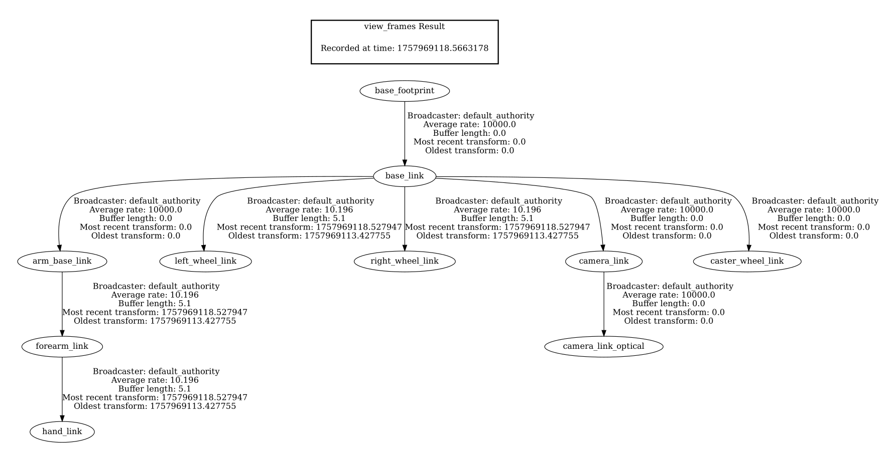
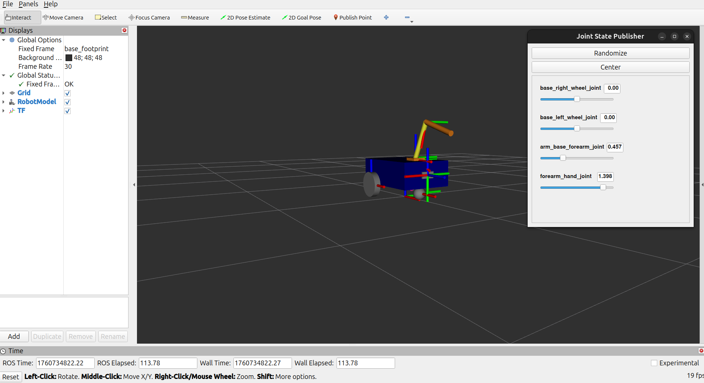
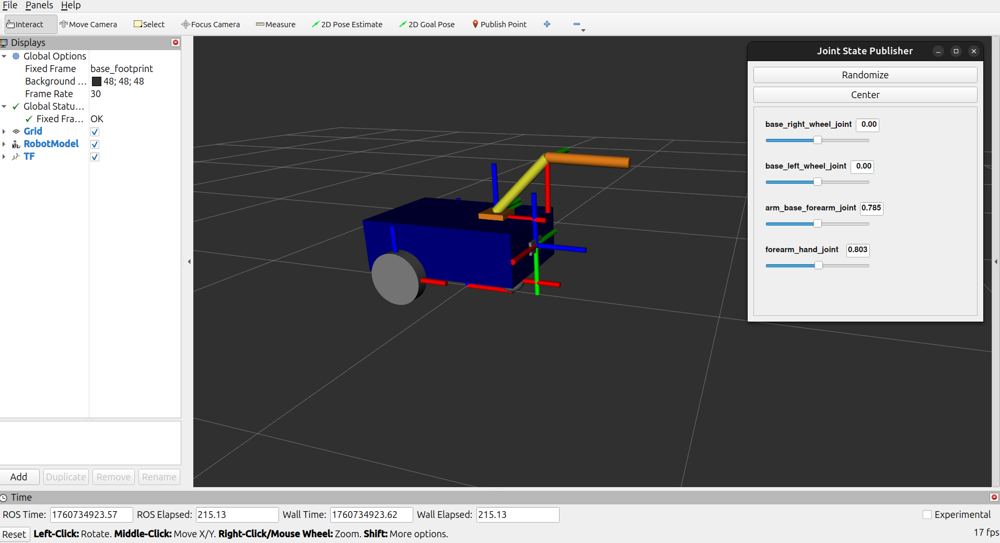
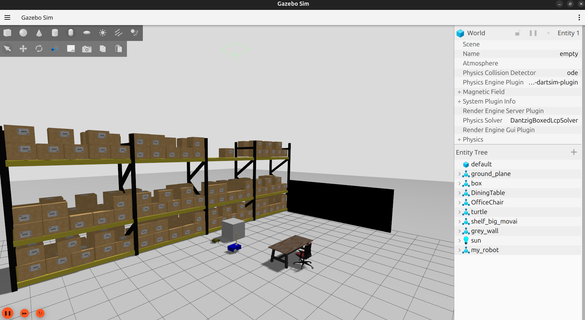
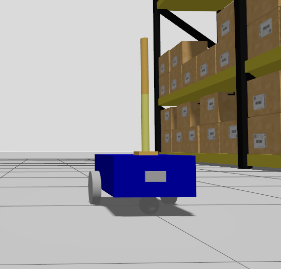

# ROS2 Robot Simulation Project 🚀

This repository contains a ROS2-based robot simulation developed by following the [ROS2 TF, URDF, RViz, Gazebo course](https://www.udemy.com/course/ros2-tf-urdf-rviz-gazebo/) taught by Edouard Renard. It demonstrates robot modeling using URDF/Xacro, visualization in RViz, and simulation in Gazebo.

## 🧠 Features
- Modular robot description using Xacro files
- TF tree visualization with `view_frames`
- RViz configuration for robot display
- Gazebo simulation with custom world
- Launch files for robot bring-up and visualization

## 📁 Project Structure
```code
ros2_ws/
└── src/
    ├── my_robot_description/
    │   ├── launch/
    │   │   ├── display.launch.xml
    │   │   └── robot.launch.xml
    │   ├── rviz/
    │   │   └── urdf_config.rviz
    │   ├── urdf/
    │   │   ├── arm.xacro
    │   │   ├── arm_gazebo.xacro
    │   │   ├── camera.xacro
    │   │   ├── common_properties.xacro
    │   │   ├── mobile_base.xacro
    │   │   ├── mobile_base_gazebo.xacro
    │   │   ├── my_robot.urdf.xacro
    │   │   └── standalone_arm.urdf.xacro
    │   ├── CMakeLists.txt
    │   └── package.xml
    │
    ├── my_robot_bringup/
    │   ├── config/
    │   │   └── gazebo_bridge.yaml
    │   ├── launch/
    │   │   └── my_robot_gazebo.launch.xml
    │   ├── worlds/
    │   │   └── test_world.sdf
    │   ├── CMakeLists.txt
    │   └── package.xml
```

## 🔧 How to Use

```bash
# Clone the repository into your ROS2 workspace
cd ~/ros2_ws/src
git clone https://github.com/yourusername/ros2_robot_simulation.git

# Build the workspace
cd ~/ros2_ws
colcon build
source install/setup.bash

# Launch the robot in Gazebo
ros2 launch my_robot_bringup my_robot_gazebo.launch.xml

# Visualize the robot in RViz
ros2 launch my_robot_description display.launch.xml
```

## 📸 Snapshots

### TF Tree
A visual representation of the robot's transform tree using view_frames:
<p align="center">
  
</p>

### RViz Display
Robot model rendered in RViz with correct TF and URDF configuration: 
<p align="center">
  
</p>

<p align="center">
  
</p>

### Gazebo World
Custom simulation world with robot spawned: 
<p align="center">
  
</p>

### My Robot
Visualization of the Robot:
<p align="center">
  
</p>

## 🌱 Future Enhancements

- Add ROS2 Navigation stack

- Integrate sensors (e.g., LiDAR, IMU)

- Extend arm control with MoveIt2

- Add SLAM and localization capabilities

## 📜 License

This project is released under the MIT License.

## 🙋‍♂️ Author

Mohammad Alghazawi — Mechatronics engineer (MSc) passionate about robotics, simulation, and ROS2 development.